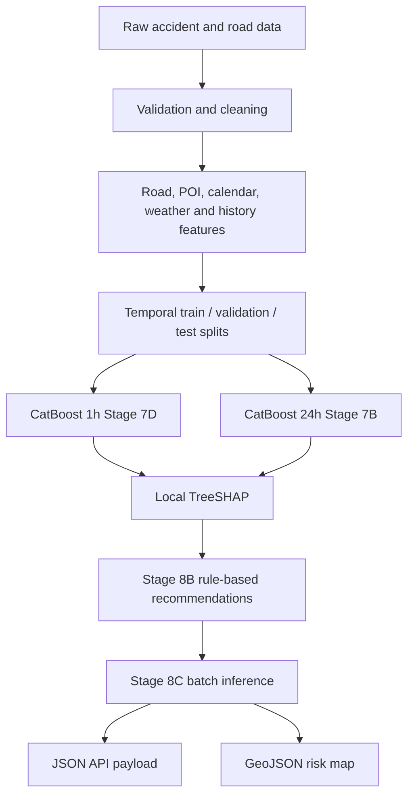

# Architecture

The inference path receives a prediction hour, builds only information available at that hour, and keeps explanations local to each road segment. Recommendations remain separate from the models and always require human review.
